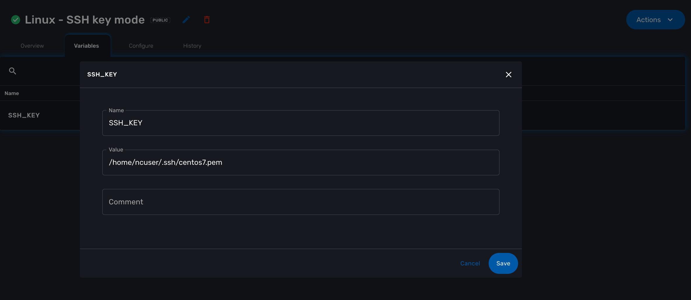

Generic adaptor for Linux
=======================

The Generic Adapter for Linux relies on SSH for running remote CLI commands on any Linux setup.

# Configuration modes

## login/password (default)
This is the default mode of the adapter. Set the login and password at the managed entity level.

The adapter will use the credentials for activation, configuration and asset management.

## SSH Key

The adapter will use a SSH key for every connection to the managed entity. The ssh CLI command will use the option "-i" to specify the SSH key to use.

### Install the SSH key in the MSActivator
To enable this mode you'll first have to install the SSH key in the MSactivator.

From the directory where the docker-compose file is installed, run:

```
docker-compose exec msa_sms mkdir -p /home/ncuser/.ssh/
MSA_SMS=`docker ps -aqf "name=msa_sms"` 
docker cp <SSH KEY FILE> $MSA_SMS:/home/ncuser/.ssh/
docker-compose exec msa_sms  chown ncuser. /home/ncuser/.ssh/<SSH KEY FILE>
docker-compose exec msa_sms chmod 400 /home/ncuser/.ssh/<SSH KEY FILE>
```

### Enable the SSH key mode

You can either enable the SSH key mode globally or locally.

#### Enable globally

If you enable the SSH key mode globally, *every* managed entities using the *Linux Generic* adapter will run with the SSH key mode

Login to the container msa_dev from the From the directory where the docker-compose file is installed:

> docker-compose exec msa_dev bash

Edit the linux_generic adapter configuration file

> vi /opt/devops/OpenMSA_Adapters/adapters/linux_generic/conf/sms_router.conf 

Uncomment the last line and set the name of the SSH key you want to use

> model-data    {"priv_key":"/home/ncuser/.ssh/<SSH KEY FILE>"}

Save the file, fix the user and exit the container

> chown -R ncuser. /opt/devops/OpenMSA_Adapters/adapters/

Restart the container msa_sms to apply the new adapter configuration
 
> docker compose restart msa_sms

#### Enable locally

You can also set the SSH key mode for a specific managed entity by setting a configuration variable SSH_KEY at the managed entity level.

The value of the variable should be set to the full path to the SSH key.



The local mode configuration takes precedence over the global mode.


